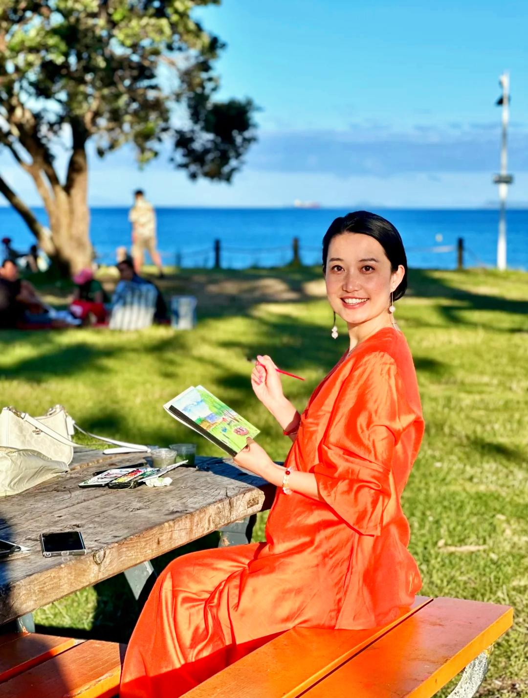

## Hey there :wave:

I'm Miao Li.

I'm a watercolor and acrylic artist who loves creating art that captures the beauty of the world around us.

I’m based in Auckland, New Zealand, and I accept commissions! Whether you’re looking for a custom piece or something to make your space extra special, I’d love to collaborate.

You can reach me on:


[Email](mm.needyee@gmail.com): mm.needyee@gmail.com





[Instagram](https://instagram.com/lm.art_studio)





[Tiktok](https://tiktok.com/@lm_art_studio)





[RedNote](https://www.xiaohongshu.com/user/profile/5e44cb1d00000000010030f0)



